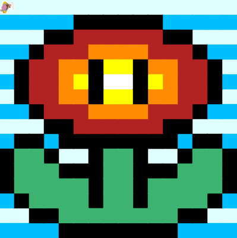
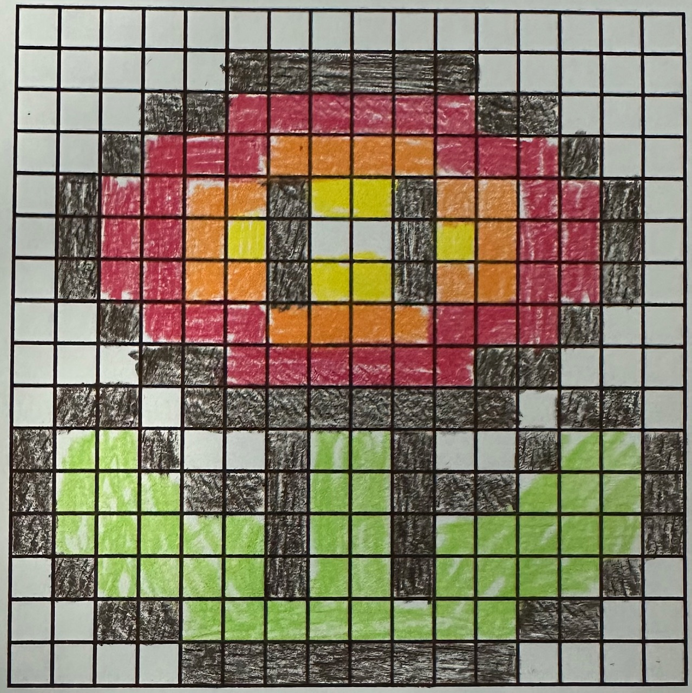

# asphalt-art-project

# Unit 1 - Asphalt Art

## Introduction

Cities use asphalt art to improve public safety, inspire their residents and visitors, and brighten communities. Your goal is to create asphalt art to revitalize The Neighborhood and bring the community together with the help of the Painter.

## Requirements

Use your knowledge of object-oriented programming, algorithms, the problem solving process, and decomposition strategies to create asphalt art:
- **Create a new subclass** – Create at least one new subclass of the PainterPlus class that is used for a component of the asphalt art design.
- **Plan an algorithm** – Use the problem solving process and decomposition strategies to plan an algorithm that incorporates a combination of sequencing, selection, and/or iteration.
- **Write a method** – Write at least one method in a PainterPlus subclass that contributes to a component of the asphalt art design.
- **Document your code** – Use comments to explain the purpose of the methods and code segments.

## Notes: Neighborhood & Painter Class

This project was created on Code.org's JavaLab platform using the built in Neightborhood GUI output. To test and edit this project you must build in Code.org's JavaLab with the Neighborhood GUI enabled. For reference to the Painter class documentation, [you can read more here.](https://studio.code.org/docs/ide/javalab/classes/Painter)

## Output:

### Final 

### Draft

## Reflection

1. Describe your project.

   The image that I created was a classic fire flower from the Mario games. It is a large flower with red, orange, black, and yellow colors. I decided to create this image because I loved playing the Mario games as a kid, and the fire flower was always my favorite item to get. I also thought that the flower would be fun to make as a pixel art, since there are several colors and multiple parts to the image. One final reason why I decided to create this flower was because I thought it would be fun to have as a pet.

2. What are two things about your project that you are proud of?

    One thing that I am very proud of is the outcome of the art. The colors and design of the flower look very unique and clean. It also looks just like the one from the Mario games! Another thing about my project that I am proud of is my "walk" method. This method allows the painter to walk a certain amount of spaces that I type, meaning that rather than using three move commands, I would use walk(3), making my coding process much more efficient.
3. Describe something you would improve or do differently if you had an opportunity to change something about your project.

   Something that I would do differently if I had an opportunity to change something about my project would be to make a 32x32 grid fire flower. It would have definitely looked much more detailed and astonishing, and I would have been able to get an extra point for it. But with the 32x32 grid, I could have implemented more colors for a more detailed design.